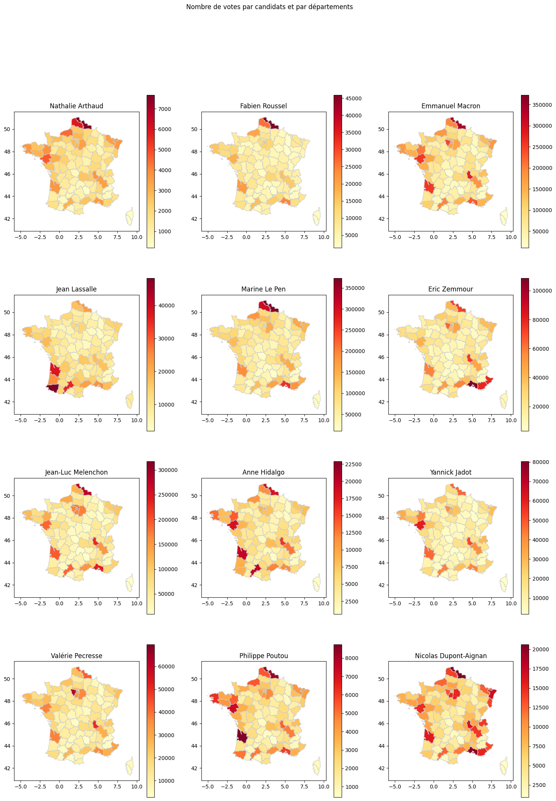

# 🗳️ **Interactive Mapping of French Presidential Elections**

> *A technical deep dive into geospatial data, electoral analytics, and interactive data visualization. Developed in collaboration with Chadrack Mayamba Hatu.*

---

## 🚀 Overview

This project was developed **two years ago** as part of our applied mathematics and data science coursework. It focuses on **visualizing French presidential election results** through an analytic and geographic visualizations.

The goal was to transform raw electoral data into **clear, navigable maps**, allowing users to explore voting behavior across various administrative levels—**regions, departments, and communes**—with intuitive and dynamic visuals.

---

## 🧠 Technical Highlights

### 📍 Geospatial Data with GeoJSON

We used **GeoJSON** to accurately represent France’s territorial divisions. These files were processed using **GeoPandas** and Python to link election results with geographic shapes, enabling smooth rendering of maps with accurate boundaries.

### 📊 Data Engineering & Analysis

* Cleaned and standardized official electoral datasets
* Computed indicators such as vote percentages, abstention rates, and leading candidates
* Aggregated results by candidate, voting round, and geographic level

---

## 🛠️ Technologies Used

* **Python 3**
* **Pandas**, **GeoPandas**, – for data and geospatial handling
* **Matplotlib** – for static visualizations
* **Jupyter Notebook** – development and presentation environment

---

## 📈 Key Outcomes

* Built a full geospatial analytics pipeline from raw data to interactive map
* Practiced real-world data cleaning and merging techniques
* Gained hands-on experience with **Python’s geospatial ecosystem**
* Strengthened team collaboration through versioning and task sharing

---

## 👥 Authors

* **Marwane Ait Mouloud**
* **Chadrack Mayamba Hatu**

Developed two years ago as part of our academic work in applied math and modeling.

---

## 🖼️ Preview

*A sample visualization of first-round presidential voting by department (placeholder)*

---

